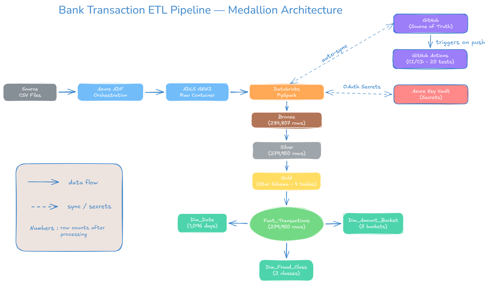

# Project 1 — Bank Transaction ETL Pipeline

A production-grade batch ETL pipeline simulating a retail 
banking data platform. Built on Azure ADF, Databricks, 
and Delta Lake following medallion architecture principles.

## Architecture



## Tech Stack

| Tool | Purpose |
|---|---|
| Azure Data Factory | Orchestration and ingestion |
| Azure Data Lake Storage Gen2 | Raw and processed storage |
| Azure Databricks | PySpark transformations |
| Delta Lake | ACID transactions, time travel |
| Azure Key Vault | Secret management |
| GitHub Actions | CI/CD automation |
| Python / PySpark | Transformation logic |

## Medallion Architecture

| Layer | Location | Rows | Description |
|---|---|---|---|
| Bronze | /processed/bronze/ | 284,807 | Raw ingested data with audit metadata |
| Silver | /processed/silver/ | 279,950 | Cleaned, validated, deduplicated |
| Gold | /curated/gold/ | 279,950 | Star schema, analytics-ready |

## Star Schema

fact_transactions (279,950 rows)
├── dim_date (1,096 days — 2024 to 2026)
├── dim_amount_bucket (5 buckets)
└── dim_fraud_class (2 classes)

## Key Business Insights Produced

- Fraud rate: 0.17% (473 fraudulent transactions)
- Highest fraud volume: micro transactions (238 cases)
- Highest fraud value: $2,125.87 (large bucket)
- Fraudulent avg transaction: $123.87 vs $89.49 legitimate

## Data Quality

Bronze quarantine pattern catches:
- Null amounts, timestamps, class labels
- Negative amounts
- Outlier amounts (> $1,000,000)
- Future timestamps (> 48 hours)

4,857 records quarantined (1.7% rejection rate)
Zero quarantined records leak to Silver or Gold.

## CI/CD

GitHub Actions runs on every push to develop/main:
- 20 unit tests (pure Python, no Spark dependency)
- Runs in under 1 second
- Spark integration tests run in Databricks

## Production Patterns Implemented

- Quarantine pattern (flag, never delete bad records)
- Delta MERGE for idempotent Silver and Gold writes
- Key Vault for all secrets (zero hardcoded credentials)
- Reconciliation check after every Gold summary write
- Post-mortem documentation for every pipeline failure
- Separation of unit tests (CI) and integration tests (Databricks)

## Failure Post-mortems

| ID | Issue | Layer | Resolution |
|---|---|---|---|
| PM-001 | Key Vault RBAC forbidden | Infrastructure | Assigned correct IAM roles |
| PM-002 | PERMISSIVE vs FAILFAST mode | Bronze | Documented mode selection criteria |
| PM-003 | All records quarantined | Bronze | Fixed bad data generator assertions |
| PM-004 | Spark config not persistent | Silver | Added OAuth config to every notebook |
| PM-005 | Delta MERGE schema mismatch | Gold | Reverted accidental column rename |
| PM-006 | Window function missing ORDER BY | Gold | Replaced row_number with avg window |
| PM-007 | dim_date single row | Gold | Pre-populated full calendar dimension |
| PM-008 | Partition column type mismatch | Gold | Delta schema enforcement caught it |
| PM-009 | Summary table inflation | Gold | Fixed append→overwrite, added reconciliation |

## How to Run

### Prerequisites
- Azure subscription with ADLS Gen2, Databricks, Key Vault
- Databricks cluster with LTS runtime
- GitHub repo connected via Databricks Repos

### Setup
1. Clone repo into Databricks Git folder on develop branch
2. Configure Key Vault secret scope (kv-bank-etl-scope)
3. Upload creditcard.csv to ADLS raw container
4. Run notebooks in order: 01 → 02 → 03

### Local testing
```bash
python -m venv .venv
.venv\Scripts\activate
pip install pytest pyyaml
pytest tests/unit/ -v
```

## Dataset

Kaggle Credit Card Fraud Detection dataset
- 284,807 transactions
- 31 features (Time, V1-V28 PCA components, Amount, Class)
- 0.17% fraud rate (real-world imbalanced dataset)
- Source: https://www.kaggle.com/datasets/mlg-ulb/creditcardfraud

## What I Learned

- Medallion architecture with clear layer separation
- Delta Lake ACID guarantees and time travel
- Production secret management with Key Vault
- Idempotent pipeline design using MERGE operations
- Systematic failure injection and post-mortem documentation
- Separation of testable Python logic from PySpark execution
- Star schema design for analytical workloads